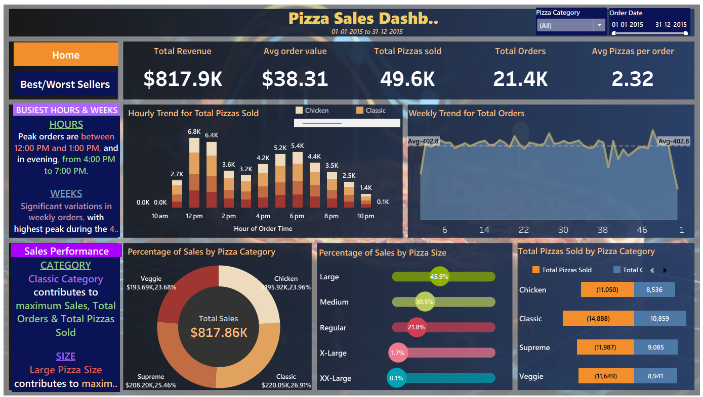

# **🍕 PIZZA SALES DASHBOARD**

## **1. Project Name**
- **Pizza Sales Dashboard**

## **2. Business Problem & Goal**
- The pizza store wanted to understand **sales performance** across different categories, sizes, and times of the day.  
- **Goal:** Identify best-selling pizzas, peak order times, and revenue trends to support inventory planning and marketing decisions.

## **3. My Role**
- Designed and built the **entire dashboard** from scratch.  
- Wrote SQL queries to **clean, transform, and analyze** data.  
- Created interactive visualizations to **highlight actionable insights** for stakeholders.

## **4. Data**
- **Dataset:** Four Excel files (order details, orders, pizza types, pizzas).  
- **Size:** 48,620 rows.  
- **Source:** Internal sales data provided for the project.  

## **5. Tools & Techniques**
- **Tools:** MS SQL Server, Microsoft Excel.  
- **Techniques:**  
  - Data cleaning (handling nulls, duplicates, and data type formatting).  
  - Aggregation of revenue, quantity, and order times.  
  - Creation of KPIs and visualizations in Excel dashboard.  

## **6. Process**
- **Step 1:** Imported and merged four raw Excel datasets.  
- **Step 2:** Cleaned and standardized data (removed duplicates, fixed data types).  
- **Step 3:** Used SQL to calculate total revenue, top 5 pizzas, most common pizza size, and hourly order distribution.  
- **Step 4:** Built Excel dashboard with interactive charts and filters.  

## **7. Key Insights**
- Identified the **highest-priced pizza** and **most common size ordered**.  
- Found the **top 5 best-selling pizzas** and **peak order hours**.  
- Revealed sales distribution by pizza category, aiding marketing focus.  

## **8. Business Impact**
- Enabled the business to **optimize inventory** by knowing peak hours and top products.  
- Helped prioritize marketing for **high-performing categories**, improving potential sales.  
- Allowed management to **forecast demand** more accurately based on time-of-day and category patterns.  
- Provided a **single source of truth** for sales metrics, reducing manual reporting time.  
- Supported **data-driven decision making** for promotions and discounts by highlighting slow-moving pizzas.
  
## **9. Obstacles & Learnings**
- **Obstacle:** Handling inconsistent pizza names and missing values across multiple files.  
- **Learning:** Developed a **systematic cleaning workflow** in SQL + Excel to streamline analysis and dashboard creation.

## **10.📊 Dashboard Overview – Pizza Sales Dashboard** 

The **Pizza Sales Dashboard** is designed to provide a comprehensive view of sales performance across different dimensions such as revenue, order trends, pizza categories, and product performance. It consists of **two main pages** for better insight:

---

### 1️⃣ Main Dashboard – Sales & Trends  

This page focuses on the **overall business metrics and trends**:  

- **Top KPIs** (Total Revenue, Average Order Value, Total Pizzas Sold, Total Orders, Average Pizzas per Order) give a quick snapshot of business health.  
- **Hourly Trend for Total Pizzas Sold** highlights peak order times. (Sales peak between **12 PM–1 PM** and **4 PM–7 PM**.)  
- **Weekly Trend for Total Orders** shows fluctuations in weekly demand, helping to identify high-performing weeks.  
- **Percentage of Sales by Pizza Category** reveals category contribution to total sales.  
- **Percentage of Sales by Pizza Size** shows which size drives the most revenue (**Large pizzas dominate sales**).  
- **Total Pizzas Sold by Pizza Category** compares sales quantity across categories for better inventory planning.  
- **Left-side Insights Panels** summarize busiest hours/weeks and top-performing categories and sizes at a glance.  

---

### 2️⃣ Best/Worst Sellers Dashboard  

This page pinpoints **product-level performance**:  

- **Top 5 Pizzas by Revenue** displays the pizzas generating the most income.  
- **Top 5 Pizzas by Total Pizzas Sold** shows the most frequently ordered pizzas.  
- **Top 5 Pizzas by Total Orders** indicates customer order frequency for each pizza.  
- **Bottom 5 Pizzas by Revenue, Quantity, and Orders** identifies low-performing pizzas.  

These insights help make **data-driven menu decisions** — whether to promote best sellers or reevaluate slow movers.  

- **Left-side Insight Panels** highlight which pizza contributes to maximum or minimum revenue, quantity, and orders.  

---

## Dashboard Preview  

