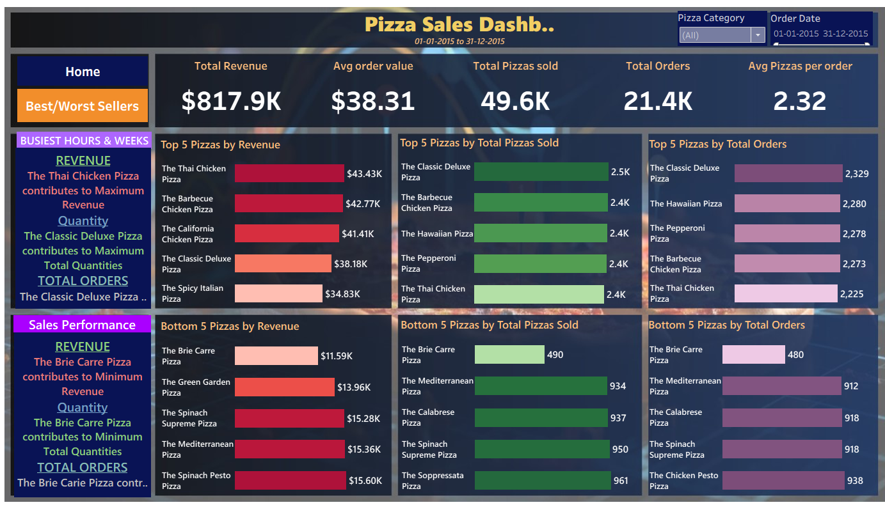

# **🍕 PIZZA SALES DASHBOARD**

## **1. Project Name**
- **Pizza Sales Dashboard**

## **2. Business Problem & Goal**
- The pizza store wanted to understand **sales performance** across different categories, sizes, and times of the day.  
- **Goal:** Identify best-selling pizzas, peak order times, and revenue trends to support inventory planning and marketing decisions.

## **3. My Role**
- Designed and built the **entire dashboard** from scratch.  
- Wrote SQL queries to **clean, transform, and analyze** data.  
- Created interactive visualizations to **highlight actionable insights** for stakeholders.

## **4. Data**
- **Dataset:** Four Excel files (order details, orders, pizza types, pizzas).  
- **Size:** 48,620 rows.  
- **Source:** Internal sales data provided for the project.  

## **5. Tools & Techniques**
- **Tools:** MS SQL Server, Microsoft Excel.  
- **Techniques:**  
  - Data cleaning (handling nulls, duplicates, and data type formatting).  
  - Aggregation of revenue, quantity, and order times.  
  - Creation of KPIs and visualizations in Excel dashboard.  

## **6. Process**
- **Step 1:** Imported and merged four raw Excel datasets.  
- **Step 2:** Cleaned and standardized data (removed duplicates, fixed data types).  
- **Step 3:** Used SQL to calculate total revenue, top 5 pizzas, most common pizza size, and hourly order distribution.  
- **Step 4:** Built Excel dashboard with interactive charts and filters.  

## **7. Key Insights**
- Identified the **highest-priced pizza** and **most common size ordered**.  
- Found the **top 5 best-selling pizzas** and **peak order hours**.  
- Revealed sales distribution by pizza category, aiding marketing focus.  

## **8. Business Impact**
- Enabled the business to **optimize inventory** by knowing peak hours and top products.  
- Helped prioritize marketing for high-performing categories, improving potential sales.  

## **9. Obstacles & Learnings**
- **Obstacle:** Handling inconsistent pizza names and missing values across multiple files.  
- **Learning:** Developed a **systematic cleaning workflow** in SQL + Excel to streamline analysis and dashboard creation.

## Dashboard Preview  

